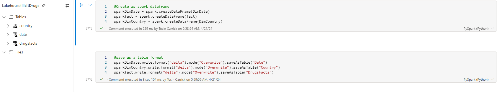

# Fabric-Analytics
An end to end project on fabric analytics using kaggle dataset
The Project is to demonstrate how to use microsoft fabric to orchestrate an end to end analytics solution by pulling data directly from an API (Kaggle platform), cleaning the data, executing mini ELT processess, analysing the data and building a report all within the capacity of a microsoft tenant and workspace which fully integrates the power of direct lake, lakehouse, data wrangler, pyspark, spark computing capabilities and power BI.

The dataset chosen for this exercise is a kaggle dataset on the use of illicit drugs across the globe
[Click Here](https://www.kaggle.com/datasets/willianoliveiragibin/illicit-drugs).
The notebook codes can be found [here](https://github.com/tosincarik/Fabric-Analytics/blob/main/Notebook_Illicit%20Drugs.ipynb)

---
### Skills demonstrated on the project includes:
1. Fabric Workspace
2. Notebook in Fabric (Python and Spark)
3. Data Cleaning (Data Wrangler)
4. Data Modelling (Star Schema)
5. Reporting and visualization
---

#### Step 1: Setting up the environment
1. Create a workspace in fabric using a licensed account or trial version
2. Create a lakehouse in the workspace which will be our database for file storage
3. Import the kaggle datasets using personal api key
4. Install kaggle in the notebook
5. Create a directory for storage of files in lakehouse
---

#### Step 2 : Download and clean dataset from kaggle
1. Connect to the kaggle api and authenticate data download
2. Read the data into a pandas dataframe
3. Wrangle dataset in data wrangler and create the fact and dimension table ( Drop duplicates, rename files, drop columns)
4. Create column index and merge tables with python for the fact and dimension tables
---

---

#### Step 3: Load data into table for reporting
1. Load data into spark dataframe
2. Load data into tables
3. Explore the SQL analytics endpoint to create views etc
4. Create measures, calculated groups, apply row level security and build reports
---

